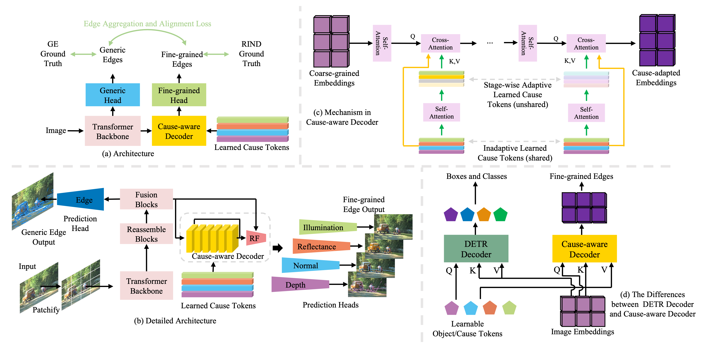

<!--
 * @Author: daniel
 * @Date: 2022-05-19 22:27:52
 * @LastEditTime: 2023-05-28 16:44:10
 * @LastEditors: daniel
 * @Description: 
 * @FilePath: /Cerberus-main/readme.md
 * have a nice day
-->
# ECT: Fine-grained Edge Detection with Learned Cause Tokens


## Introduction

In this study, we tackle the challenging fine-grained edge detection task, which refers to predicting specific edges caused by reflectance, illumination, normal, and depth changes, respectively. Prior methods exploit multi-scale convolutional networks, which are limited in three aspects: (1) Convolutions are local operators while identifying the cause of edge formation requires looking at far away pixels. (2) Priors specific to edge cause are fixed in prediction heads. (3) Using separate networks for generic and fine-grained edge detection, and the constraint between them may be violated. To address these three issues, we propose a two-stage transformer-based network sequentially predicting generic edges and fine-grained edges, which has a global receptive field thanks to the attention mechanism. The prior knowledge
of edge causes is formulated as four learnable cause tokens in a cause-aware decoder design. Furthermore, to encourage the consistency between generic edges and fine-grained edges, an edge aggregation and alignment loss is exploited. We evaluate our method on the public benchmark BSDS-RIND and several newly derived benchmarks, and achieve new state-of-the-art results. Our code, data, and
models will be made public.




## Installation

### Environment 


```
bash install.sh
```
after this finishing this script, the envirnment name, ect, will be created. Then, you can use `conda activate ect` to activate the environment.

### Data preparation

BSDS-RIND dataset ( [BaiDuNetDisk](https://pan.baidu.com/s/1wrxQyqAJQG1adyk4RzGDmw): code qc62) should have the following hierachy inside project_root/data:


```
BSDS-RIND
├── BSDS-RIND
│   └── Augmentation
│       ├── Aug_HDF5EdgeOriLabel
│       └── Aug_JPEGImages
├── BSDS-RIND-Edge
│   └── Augmentation
│       ├── Aug_HDF5EdgeOriLabel
│       └── Aug_JPEGImages
├── test
├── testgt
│   ├── all_edges
│   ├── depth
│   ├── illumination
│   ├── normal
│   └── reflectance
```


### Pretrained model 

The alignment network [BaiDuNetDisk](https://pan.baidu.com/s/1K_HWsIJOoGrtcOmtcEj9wg): code eka2 should be placed inside `pretrained_models` directory.


## Training and evaluation 


To train a ECT on BSDS-RIND, run: 

```
bash scripts/train_ect.sh

```

After finishing training, the training and evaluation results can be found at `networks/2023-05-26-XXX`. 


## Reproducing the results reported in our paper

download our [trained model](https://pan.baidu.com/s/1A4okqEcx8VxUE36QpNwupw) (code: t6hc) the evaluate by following steps: 
1. modify the variable of  resume_model in `scripts/test_ect.sh` 
2. run: 
```
bash scripts/test_ect.sh
```


<!-- after finishing training, the results is constructed as follows: -->
<!-- 
```
networks
├── 2023-05-26-XXX
    ├──XXX
        ├── eval_res.json
        ├── all_edges
        │   └── met
        ├── attention
        ├── depth
        │   ├── met
        │   ├── modelname-depth.jpg
        │   ├── nms
        │   └── nms-eval
        ├── eval_res.json
        ├── illumination
        │   ├── met
        │   ├── modelname-illumination.jpg
        │   ├── nms
        │   └── nms-eval
        ├── normal
        │   ├── met
        │   ├── modelname-normal.jpg
        │   ├── nms
        │   └── nms-eval
        └── reflectance
            ├── met
            ├── modelname-reflectance.jpg
            ├── nms
            └── nms-eval
    ├──checkpoints
        ├──ckpt_ep0XXX.pth.tar
        ................................................................
...
``` -->


## Citation

If you find our work useful in your research, please consider citing:

```
coming soon 
```