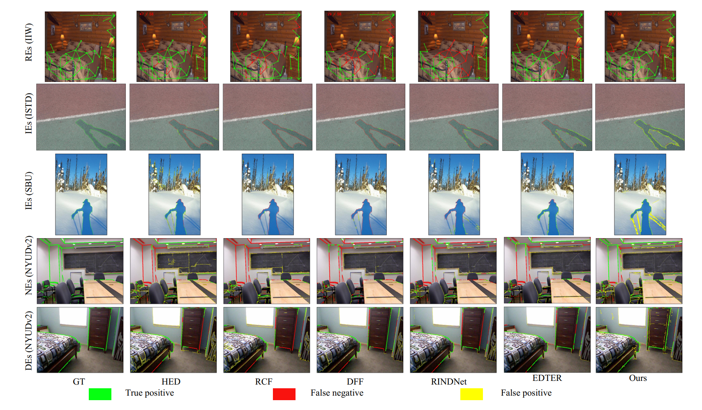

<!--
 * @Author: daniel
 * @Date: 2024-02-15 20:57:06
 * @LastEditTime: 2024-02-15 21:44:49
 * @LastEditors: daniel
 * @Description: 
 * @FilePath: /Cerberus-main/transferibility/readme.md
 * have a nice day
-->

# Transferability Experiments
This document aims to detail the benchmark of Transferability Experiments.



| Method    | Reflectance (IIW) | Illumination (ISTD) ODS | Illumination (ISTD) OIS | Illumination (ISTD) AP | Illumination (SBU) ODS | Illumination (SBU) OIS | Illumination (SBU) AP | Normal (NYUDv2) ODS | Normal (NYUDv2) OIS | Normal (NYUDv2) AP | Depth (NYUDv2) ODS | Depth (NYUDv2) OIS | Depth (NYUDv2) AP |
|-----------|-------------------|-------------------------|-----|----|-----------------------|-----|----|---------------------|-----|----|---------------------|-----|----|
| HED       | 0.638             | 0.508                   | 0.515 | 0.499 | 0.566                 | 0.618 | 0.565 | 0.332               | 0.342 | 0.149 | 0.360               | 0.376 | 0.185 |
| RCF       | 0.594             | 0.492                   | 0.510 | 0.463 | 0.535                 | 0.586 | 0.510 | 0.320               | 0.325 | 0.120 | 0.347               | 0.364 | 0.172 |
| DFF       | 0.481             | 0.478                   | 0.495 | 0.299 | 0.475                 | 0.483 | 0.297 | 0.271               | 0.272 | 0.081 | 0.340               | 0.348 | 0.142 |
| RINDNet   | 0.519             | 0.547                   | 0.584 | 0.465 | 0.557                 | 0.595 | 0.471 | 0.333               | 0.337 | **0.156** | 0.357               | 0.369 | 0.175 |
| EDTER     | 0.458             | 0.552                   | 0.631 | 0.511 | 0.599                 | 0.651 | 0.534 | 0.333               | 0.340 | 0.131 | 0.349               | 0.360 | 0.170 |
| **Ours**  | **0.641**         | **0.642**               | **0.689** | **0.664** | **0.591**         | **0.656** | **0.599 (+3.4%)** | **0.343** | **0.352** | 0.146 | **0.369** | **0.383** | **0.197** |


##  SBU 

1. download the [SBU](https://www3.cs.stonybrook.edu/~cvl/dataset.html) dataset and the [pre-processed data](https://drive.google.com/file/d/1_VSZqJp-x_E9gIyHrJwM3-wlBD2eRds7/view?usp=drive_link). 
2. structure the the data as follows:

```
└── data
    └── SBU
        └── SBU-shadow
            ├── ImageSets
            ├── SBU-Test
            │   ├── EdgeMap
            │   ├── EdgeMapMat
            │   ├── ShadowImages
            │   └── ShadowMasks
            └── SBUTrain4KRecoveredSmall
                ├── EdgeMap
                ├── EdgeMapMat
                ├── ShadowImages
                └── ShadowMasks
```
Note: SBUTrain4KRecoveredSmall is optional  as we only use this data for evaluation.


3.  run following script for evaluation
```
python transferibility/test_ISTD_SBU.py --eval_dataset SBU
```

##  ISTD 

1. download [ISTD](https://drive.google.com/file/d/1I0qw-65KBA6np8vIZzO6oeiOvcDBttAY/view) dataset and our [pre-processed data](https://drive.google.com/file/d/1GNxS4rMzff7ZKHg2rcNUPE9VqcpueGK8/view?usp=drive_link).
2. structure the the data as follows:
```
└── data
    └── ISTD
        └── ISTD_Dataset
            ├── ImageSets
            ├── test
            │   ├── EdgeMap
            │   ├── EdgeMapMat
            │   ├── test_A
            │   ├── test_B
            │   └── test_C
            └── train
                ├── EdgeMap
                ├── EdgeMapMat
                ├── train_A
                ├── train_B
                └── train_C
```
Note: train directory is optional  as we only use this data for evaluation.
3.  run following script for evaluation

```
python transferibility/test_ISTD_SBU.py --eval_dataset ISTD
```


## IIW 

1. Downlaod the [IIW dataset](http://opensurfaces.cs.cornell.edu/publications/intrinsic/#download). 
2. structure the the data as follows:
```
└── data
    └── IIW
        ├── data_transforms.py
        ├── iiw_dataset.py
        └── iiw-dataset
            ├── data
            ├── ImageSets
            ├── info.json
            ├── README.md
            ├── test.txt
            ├── train.txt
            └── whdr.py
```

3. run following script for evaluation

```
python transferibility/test_IIW.py
```


## NYUD2

1. download the [dataset](https://drive.google.com/file/d/1QSotKnOaf07Pql53M-_S96yBRvlWirzH/view?usp=drive_link)
2. structure the the data as follows:

```
└── data
    └── nyud2
        └── NYU_origin
            └── ...
```

3. run following script for evaluation


```
python transferibility/test_NYU.py
```